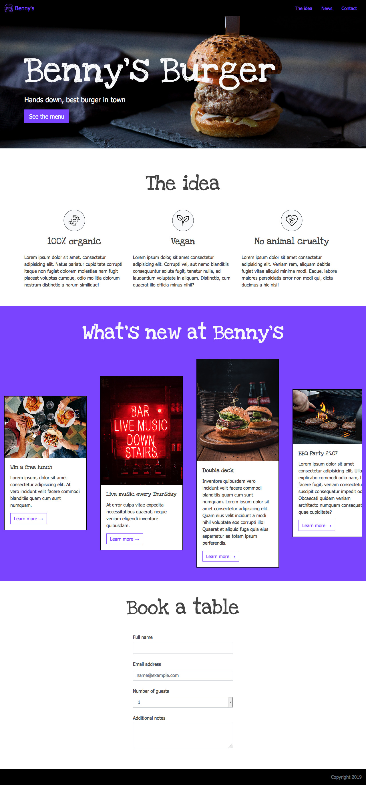

# Benny's burger

Lass uns Bootstrap benutzen, um eine Restaurant-Seite zu erstellen!

Schau Dir die Beispielbilder für das Layout an.

## Anforderungen

### Styling und Responsivity
-   Nutze `sass` um die Seite zu gestalten. Es ist bereits als `devDependency` konfiguriert (s. `package.json`). Arbeite in der Datei `src/scss/main.scss`.
-   Arbeite in der Datei `src/index.html`.
-   Füge Bootstrap mittels `npm` zum Projekt hinzu.
-   Nutze Bootstrap um das Projekt responsiv zu machen.
### Navigationsleiste
-   Nutze das semantisch passende HTML-Tag um die Navigationsleiste anzulegen.
-   Die Navigationsleiste sollte ein Logo-Bild haben und eine Item-Liste für die Navigations-Elemente nutzen. 
-   Die Navigationsleiste sollte auch beim Scrollen am oberen Rand des Fensters sichtbar bleiben.

### Banner
-   Der Banner-Bereich, dwer die Überschrift "Benny\'s burger" beinhaltet, sollte die ID `#banner` haben.
-   Das Banner-Element sollte das Hintergrundbild aus dem Ordner `./src/images/` haben.
-   Das Banner sollte einen Titel `<h1>` mit dem Font/Schriftart "[`Love Ya Like A Sister`](https://fonts.google.com/specimen/Love+Ya+Like+A+Sister)" haben.

### Bereich: "The Idea"
-   Der Container des "The idea"-Bereichs sollte die ID `#about-us` haben.
-   Erstelle innerhalb des Containers einen Titel `<h2>` mit dem Font "[`Love Ya Like A Sister`](https://fonts.google.com/specimen/Love+Ya+Like+A+Sister)".
-   Nutze Bootstrap um den Inhalt des Bereichs bei großen Bildschirmen (Desktop) auf drei Spalten zu verteilen.
### Breich: "What's new"
-   Der Container des Bereichs soll die ID `#team` haben.
-   Der Bereich soll einen Titel `<h2>` mit dem Font "[`Love Ya Like A Sister`](https://fonts.google.com/specimen/Love+Ya+Like+A+Sister)" enthalten.
-   Nutze Bootstraps Card-Komponente um die Inhalts-Elemente mit Bild und Text zu erstellen.
-   Nutze die passende Bootstrap-Klasse um die Spalten auf der Seite zu zentrieren (engl. **center**).

### Bereich: "Book a table"
-   Der Container sollte die ID `#contact` haben. 
-   Der Container sollte einen Titel `<h2>` mit dem Font "[`Love Ya Like A Sister`](https://fonts.google.com/specimen/Love+Ya+Like+A+Sister)" haben.

### Navigations-Interaktion
-   Du hast bereits drei Navigations-Elemente/-Items ("Nav-Item") innerhalb eines `nav`-Elements angelegt. Beim Anklicken eines solchen Nav-Items, soll die Seite zum entsprechenden Bereich scrollen, z. B. , __nach Klick auf 'Contact' in der Navigationsleiste, soll zum "Book a table"-Bereich gescrollt werden__.

## Desktop

## Tablet

## Mobile

Hinweis: Wirf einen Blick in die Datei `node_modules/scss/bootstrap/_variables.scss`, um zu sehen, welche Variablen Du ansteuern musst, um eigene Werte zu setzen.
